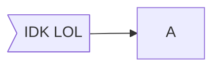

---

id: 202007251216
tags:
 - #obsidian
 - #markdown
 - #mermaid
 - #statistics
source: https://mermaid-js.github.io/mermaid/#/README

---

# Obsidian Graph Formatting
Obsidian supports Mermaid, a [[Markdown]]-inspired script language for generating charts from text-definitions, via [[JavaScript]]. 

---
# Pie Charts
---


---
# Graphs / Flowcharts
---
## Directions


## Shapes
Follow `<NODE NAME><FORMATTING OPEN BRACKETS> <TEXT> <FORMATTING CLOSE BRACKETS>` Format.
1. `<NODE NAME>` can be any name to connect to that node, such as: `A`, `boxA`

3. `<FORMATTING BRACKETS>` includes any number of combinations of `[ ]`, `( )`, `{ }`, `/ /`, `\ \`, `>`

4. `<TEXT>` is what will eb displayed on inside the node

#### Normal Box:

#### Pill-Shaped Box:

#### Squircle

#### Subroutine Box

#### DB Cylinder

#### Circle

#### Asymmetric Shape

#### Rhombus

#### Rhombus

#### Hexagon

#### Parallelogram

#### Trapezoid

## Links
Can be used in combination with Shape formatting and additional link formatting
#### Basic

#### Open

#### Dotted
```mermaid
graph LR
crcl(( Circle )) -.-> B -.-> C -.- crcl
```
#### Text
```mermaid
graph LR
crcl(( Circle )) --This--> B --is some--> C --Text--> crcl
```
#### Thicc
```mermaid
graph LR
crcl(( Circle ))==> B ==> C ==> crcl
```

#### Combined Examples
```mermaid
graph LR
crcl(( Circle )) -.- B -.-> C --- crcl
```

```mermaid
graph LR
crcl(( Circle )) -.This.-> B --is some--- C --Text--> crcl
```

---
# Gantt Charts
---
```mermaid
gantt
title This is a title
dateFormat DD-MM-YY
section Obsidian Basics

Markdown: a1, 04-07-2020, 3d
Diagrams: after a1, 07-07-2020, 2d

section OtherVideos

Example Video: 01-07-2020, 5d
Video2: 07-07-2020, 12d

```

---
# Sequence Diagrams
---
```mermaid
sequenceDiagram
Alice ->> John: Hello John, how are you?

John -->> Alice: Great!

```

---
# Class Diagrams
---
```mermaid
classDiagram

class Animal
Vehicle <|-- Car

```


---
# State Diagrams
---
```mermaid
stateDiagram-v2

push --> Move
Move --> Stop

[*] --> State1
State1 --> [*]

```

---
# Entity Relationship Diagrams
---
```mermaid
erDiagram

CUSTOMER ||--0{ ORDER : places
ORDER ||--|{ LINE-ITEM : contains
CUSTOMER }|..|{ DELIVERY-ADDRESS : uses

```

---
# User Journey
---

```mermaid
journey

title My Work Day
section Go to Work
	Make tea: 5: Me
    Go upstairs: 3: Me
    Do work: 1: Me, Cat
section Go Home
	Go downstairs: 5: Me
    Sit Down: 5: Me
```


## See Also
[[Obsidian Markdown Formatting]]
[Mermaid Live Editor](https://github.com/mermaidjs/mermaid-live-editor)

## References
